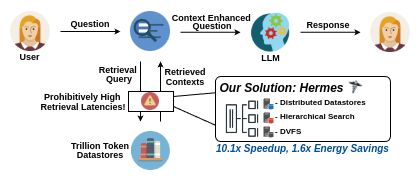
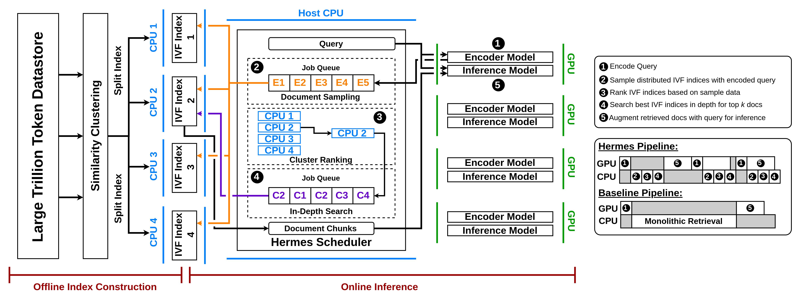
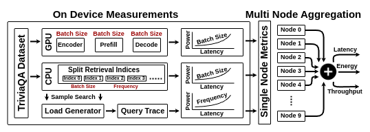

# Hermes

Hermes is a public, open-source evaluation framework implementing the methodology described in:

## **Hermes: Algorithm-System Co-design for Efficient Retrieval Augmented Generation At-Scale**



---

## Overview

Hermes is an algorithm-system co-design framework that intelligently distributes search clusters across multiple machines, employing hierarchical search and Dynamic Voltage and Frequency Scaling (DVFS) to optimize retrieval latency and energy consumption. Built on open-source LLMs and retrieval indices from publicly available datasets, running on commodity hardware, Hermes achieves:

✅ **10x reduction in latency**  
✅ **2x improvement in energy efficiency**



📖 **Read our full paper:** [here](https://anonymous.com)

📈 **Explore our profiled inference and retrieval data with RAGCAT:** [here](https://s4ai-cornelltech.github.io/ragcat/)

🔗 **If you use Hermes or RAGCAT in your research, please cite us:**  
```
@inproceedings{shenHermes2025,
    author = {Shen, Michael and Umar, Muhammad and Maeng, Kiwan and Suh, G. Edward and Gupta, Udit},
    title = {Hermes: Algorithm-System Co-design for Efficient Retrieval Augmented Generation At-Scale},
    year = {2025},
    isbn = {},
    publisher = {Association for Computing Machinery},
    address = {New York, NY, USA},
    url = {},
    doi = {},
    abstract = {The rapid advancement of Large Language Models (LLMs) as well as the constantly expanding amount of data make keeping the latest models constantly up-to-date a challenge. The high computational cost required to constantly retrain models to handle evolving data has led to the development of Retrieval-Augmented Generation (RAG). RAG presents a promising solution that enables LLMs to access and incorporate real-time information from external datastores, thus minimizing the need for retraining to update the information available to an LLM. However, as the RAG datastores used to augment information expand into the range of trillions of tokens, retrieval overheads become significant, impacting latency, throughput, and energy efficiency. To address this, we propose Hermes, an algorithm-systems co-design framework that addresses the unique bottlenecks of large-scale RAG systems. Hermes mitigates retrieval latency by partitioning and distributing datastores across multiple nodes, while also enhancing throughput and energy efficiency through an intelligent hierarchical search that dynamically directs queries to optimized subsets of the datastore. On open-source RAG datastores and models, we demonstrate Hermes optimizes end-to-end latency and energy by up to 10.1× and 1.6×, without sacrificing retrieval quality for at-scale trillion token retrieval datastores},
    booktitle = {Proceedings of the 52nd Annual International Symposium on Computer Architecture},
    pages = {},
    numpages = {},
    keywords = {Retrieval-Augmented Generation, Information Retrieval, Large Language Models, Natural Language Processingg},
    location = {Tokya, Japan},
    series = {ISCA '25}
}
```
---

## Open Source Datasets and Models

Hermes leverages publicly available datasets:

📂 **Datasets**
- [SPHERE_899M](https://huggingface.co/datasets/mohdumar/SPHERE_899M) – BERT Encoded 899M Subset of Common Crawl
- [SPHERE_100M](https://huggingface.co/datasets/mohdumar/SPHERE_100M) – BERT Encoded 100M Subset of Common Crawl
- [SPHERE_100K](https://huggingface.co/datasets/mohdumar/SPHERE_100K) – BERT Encoded 100K Subset of Common Crawl
- [TriviaQA](https://nlp.cs.washington.edu/triviaqa/) – Open-domain QA dataset

🧠 **Models**
- [GEMMA-2 9B](https://huggingface.co/google/gemma-2-9b)
- [BGE-Large](https://huggingface.co/BAAI/bge-large-en)
- [BERT-Base-Uncased](https://huggingface.co/google-bert/bert-base-uncased)

---

## Quickstart Guide

1. **[Environment Setup](#setup)**
2. **[Create Monolithic, Split, and Hermes Cluster Search Indices](#datastore-creation)**
3. **[Profile Search Latencies, Recall, and Energy](#retrieval-profiling)**
4. **[Profile Latency and Energy of Encoding & Inference](#encoding--inference-profiling)**
5. **[Generate Cluster Access Traces](#trace-generator)**
6. **[Run Multi-Node Aggregation Analysis](#multi-node-aggregation)**

🚀 Quick Scripts for Automated Building, Profiling, and Data Collection on Hermes:
- ```build.sh```: Build Flat, Monolithic, Clustered, and Split Retrieval Indices with 100K datastore
- ```profile.sh```: Profile Latency and Power of 100K Monolithic, Clustered, and Split Retrieval Index Latencies, Also Profiles SOTA Encoder and Inference Model Latency and Power
- ```eval.sh```: Models Hermes Latency and Energy Usage for Retrieval and runs hermes accuracy analysis scripts
- ```isca_figures.sh```: Using the given data in 100m_data to produce the figures in the isca paper

To generate the figures for the ISCA paper, first run ```build.sh```, then execute ```isca_figures.sh```. The other workflows should only be used if you plan to build, profile, and evaluate your own indices. 

---

## Setup

1. **Create a Conda Environment:**
    ```bash
    conda create -n hermes python=3.11
    conda activate hermes
    ```

2. **Clone Repository:**
    ```bash
    git clone https://github.com/Michaeltshen/Hermes.git
    cd Hermes
    ```

3. **Pull Large Files With git lfs:**

    Hermes uses Git Large File Storage (LFS). Alternatively, manually download the required files and place them in the corresponding folders:

    ```bash
    conda install conda-forge::git-lfs
    git lfs install
    git lfs pull
    ```

    Alternative: 

    - [`triviaqa_encodings.npy`](https://drive.google.com/file/d/1xFBQnltn_KtwSjE-aGIChgwxtyKroneJ/view?usp=sharing) → `triviaqa/`

4. **Install Dependencies:**
    ```bash
    conda install -c pytorch -c nvidia faiss-gpu=1.8.0 pytorch=*=*cuda* pytorch-cuda=11 numpy
    conda install -c conda-forge gcc_linux-64 gxx_linux-64
    pip install transformers vllm datasets pynvml matplotlib
    ```

5. **Torchvision Dependency Corrections:**

    If you encounter CUDA version mismatches between PyTorch and torchvision, run the following command to automatically detect and install the correct torchvision version for your setup:
    ```bash
    source setup/torchvision_version_fix.sh
    ```
    This script ensures that torchvision matches your installed PyTorch version and CUDA compatibility, preventing runtime errors.

---

## Datastore Creation

### SPHERE Index Creation

Building large-scale indices (e.g., 1B–10B vectors) can take days or weeks. These indices can also reach hundreds of gigabytes in size. Choose an approach based on your requirements:

🔹 **Monolithic Index**
```bash
python index/create_monolithic_index.py --index-size 100K
```
🔹 **Evenly Split Indices**
```bash
python index/create_split_indices.py --dataset-size 100k --num-indices 10
```
🔹 **Clustered Hermes Indices**
```bash
python index/create_clustered_indices.py --dataset-size 100k --num-indices 10
```
🔹 **Flat Index**
```bash
python index/create_flat_index.py --index-size 100k
```

📌 **Custom Datasets:** Modify the dataset loading logic in the index creation files. However, you must ensure that your dataset comes pre-encoded or modify the script logic to encode each document before adding it to the index. 

### Synthetic Indices

For benchmarking, create synthetic indices:
```bash
python index/synthetic_create_monolithic_index.py --index-size 1m --dim 768 --threads 32
```

---

## Hardware Profiling

Measure retrieval latency and energy performance of Hermes.

📌 **Pre-profiled results available at:** [Website]

### **Retrieval Profiling**

Example Retrieval latency tests:
```bash
python measurements/latency/retrieval_monolithic_latency.py \
    --index-name data/indices/monolithic_indices/hermes_index_monolithic_100k.faiss \
    --nprobe 128 \
    --batch-size 16 32 64 \
    --retrieved-docs 5 10 \
    --num-threads 32 \
    --queries triviaqa/triviaqa_encodings.npy 

python measurements/latency/retrieval_split_latency.py \
    --index-folder data/indices/split_indices \
    --nprobe 128 \
    --batch-size 32 64 \
    --retrieved-docs 10 20 \
    --num-threads 32 \
    --dataset-size 1000000 \
    --queries triviaqa/triviaqa_encodings.npy

python measurements/latency/retrieval_hermes_clusters_latency.py \
    --index-folder data/indices/hermes_clusters \
    --nprobe 8 128 \
    --batch-size 1 2 4 8 16 24 32 40 48 56 64 72 80 88 96 104 112 120 128 136 144 152 160 \
    --retrieved-docs 5 \
    --num-threads 32 \
    --queries triviaqa/triviaqa_encodings.npy

```

### **Encoding & Inference Profiling**

⚡ **Measure Latency and Power Usage** for different encoding and inference models.

For a comprehensive list of supported inference models, please refer to the [vllm documentation](https://docs.vllm.ai/en/latest/models/supported_models.html)

Example Encoding and Inference latency tests:
```bash
python measurements/latency/encoding_latency.py \
    --model-name BAAI/bge-large-en \
    --batch-size 16 32 \
    --input-lengths 16 32 64 128

python measurements/power/encoding_power.py \
    --model-name BAAI/bge-large-en \
    --batch-size 16 32 \
    --input-lengths 16 32 64 128

python measurements/latency/inference_latency.py \
    --model-name "google/gemma-2-9b" \
    --num-gpus 1 \
    --batch-size 16 32 \
    --input-lengths 32 128 512 \
    --output-lengths 4 16 32

python measurements/power/inference_power.py \
    --model-name "google/gemma-2-9b" \
    --num-gpus 1 \
    --batch-size 16 32 \
    --input-lengths 32 128 512 \
    --output-lengths 4 16 32
```

---

## Multi Node Aggregation Tool



This tool models and aggregates data across multiple nodes for system performance optimization.

📌 **Includes:**
- **Trace Generator** – Generate cluster access traces
- **Multi-Node Aggregation** – Analyze RAG inference latency and energy usage

### Trace Generator

Generate the cluster access traces
```bash
python modeling/trace_generator.py
```

### Multi Node Aggregation

```bash
python modeling/latency_sim.py \
    --latency-data data/profiling/hermes_cluster_latency.csv \
    --query-trace data/modeling/cluster_trace.csv \
    --retrieved-docs 5 \
    --batch-size 32 64 \
    --sample-nprobe 8 \
    --deep-nprobe 128 \
    --num-threads 32 
```

---

## Evaluation

### Accuracy Evaluation

```bash
python measurements/accuracy/evaluate_retrieval_accuracy.py \
    --flat-index data/indices/flat_indices/hermes_index_flat_100k.faiss \
    --monolithic-index data/indices/monolithic_indices/hermes_index_monolithic_100k.faiss \
    --split-index-folder data/indices/split_indices \
    --split-index-size 100000 \
    --cluster-index-folder data/indices/hermes_clusters/clusters \
    --cluster-index-indices-folder data/indices/hermes_clusters/cluster_indices \
    --nprobe 128 \
    --sample-nprobe 8 \
    --retrieved-docs 5 \
    --queries triviaqa/triviaqa_encodings.npy 
```

### DVFS Evaluation

```bash
python modeling/dvfs_sim.py \
    --latency-frequency-data 100m_data/hermes_platinum_8380_100m_dvfs_latency.csv \
    --power-frequency-data 100m_data/hermes_platinum_8380_100m_dvfs_power.csv \
    --query-trace data/modeling/cluster_trace.csv \
    --inference-trace data/profiling/inference_latency.csv \
    --retrieved-docs 5 \
    --batch-size 32 \
    --sample-nprobe 8 \
    --deep-nprobe 128 \
    --num-threads 32 \
    --input-size 512 \
    --stride-length 16 \
```

### Figures

```bash
python figures/fig_11_hermes_accuracy_comparison.py \
    --data-file data/accuracy_eval.csv

python figures/fig_12_hermes_nprobe_dse_ndcg.py \
    --data-file data/accuracy_eval.csv

python figures/fig_13_cluster_size_frequency_analysis.py \
    --index-folder data/indices/hermes_clusters/clusters \
    --cluster-access-trace data/modeling/cluster_trace.csv \
    --clusters-searched 5

python figures/fig_14_end_to_end_hermes_latency_comparison.py \
    --input-size 512 \
    --output-size 128 \
    --stride-length 16 \
    --batch-size 32 \
    --sample-nprobe 8 \
    --deep-nprobe 128 \
    --retrieved-docs 5 \
    --clusters-searched 4 \
    --monolithic-retrieval-trace data/profiling/retrieval_monolithic_latency.csv \
    --hermes-retrieval-trace data/modeling/hermes_retrieval.csv \
    --encoding-trace data/profiling/encoding_latency.csv \
    --inference-trace data/profiling/inference_latency.csv

python figures/fig_15_ttft_hermes_latency_comparison.py \
    --input-size 512 \
    --stride-length 16 \
    --batch-size 32 \
    --sample-nprobe 8 \
    --deep-nprobe 128 \
    --retrieved-docs 5 \
    --clusters-searched 4 \
    --monolithic-retrieval-trace data/profiling/retrieval_monolithic_latency.csv \
    --hermes-retrieval-trace data/modeling/hermes_retrieval.csv \
    --encoding-trace data/profiling/encoding_latency.csv \
    --inference-trace data/profiling/inference_latency.csv

python figures/fig_20_hermes_diff_hardware_comparison.py \
    --sample-nprobe 8 \
    --deep-nprobe 128 \
    --retrieved-docs 5 \
    --batch-size 32 \
    --hermes-retrieval-traces data/modeling/hermes_retrieval.csv
```

## License
This project is licensed under the **MIT License**. See the LICENSE file for full details.

