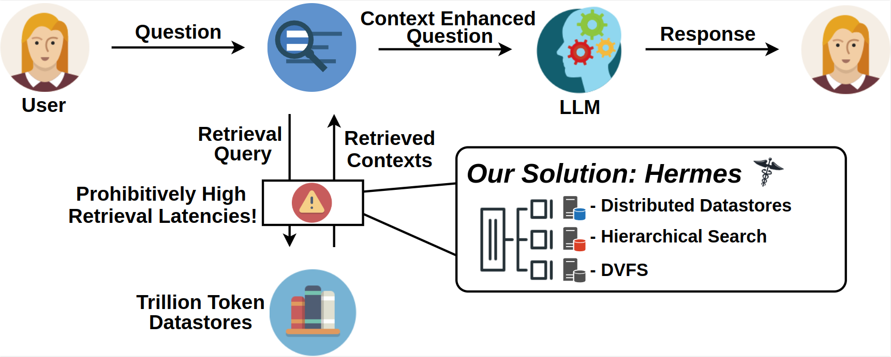
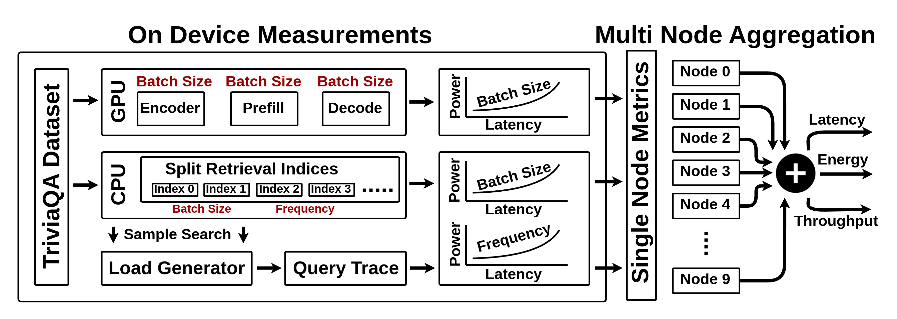

# Hermes

Hermes is a public, open‐source evaluation framework implementation for the methodology described in this paper: **"Hermes: Algorithm-System Co-design for Efficient Retrieval Augmented Generation At-Scale"**



---

## Overview

Hermes is an algorithm-system co-design framework that intelligently distributes search clusters across multiple machines, employing hierarchical search along with Dynamic Voltage and Frequency Scaling (DVFS) to significantly reduce retrieval latency and energy consumption. Using open-source LLMs and retrieval indices built on publicly available datasets running on commodity hardware platforms, Hermes achieves:

- **10x reduction in latency**
- **2x improvement in energy efficiency**


Please see our full paper [here](https://anonymous.com).

If you use Hermes in your research, please cite us:

```Citation```

---

## Open Source Datasets and Models

This evaluation framework leverages several publicly available datasets:

- **SPHERE_899M**: [Explore Bert Encoded 899M Subset of Common Crawl](https://huggingface.co/datasets/mohdumar/SPHERE_899M)
- **SPHERE_100M**: [Explore Bert Encoded 100M Subset of Common Crawl](https://huggingface.co/datasets/mohdumar/SPHERE_100M)
- **SPHERE_100K**: [Explore Bert Encoded 100K Subset of Common Crawl](https://huggingface.co/datasets/mohdumar/SPHERE_100K)
- **TriviaQA**: [Explore TriviaQA](https://nlp.cs.washington.edu/triviaqa/)

And Several Open Source Models: 

- **GEMMA-2 9B**: [Explore Gemma-2](https://huggingface.co/google/gemma-2-9b)
- **BGE-Large**: [Explore BGE-Large](https://huggingface.co/BAAI/bge-large-en)
- **Bert-Base-Uncased**: [Explore bert-base-uncased](https://huggingface.co/google-bert/bert-base-uncased)

---

## Quickstart
1. [Environment Setup](#setup)
1. [Create Monolithic, Split, and Hermes Cluster Search Indices](#datastore-creation)
2. [Profile search latencies, recall, and energy of index searches](#retreival)
3. [Profile latency and energy usage of encoding and inference models](#inference)
4. [Create a set of cluster access traces that will be used with our multi node aggregation tool](#trace-generator) 
5. [Use the Multi Node Aggregation Tool to analyze end to end RAG inference latency and energy](#multi-node-aggregation)

## Setup

### Environment

To set up your development environment:

1. **Create a Conda Environment:**

    ```bash
    conda create -n hermes python=3.11
    conda activate hermes
    ```

2. **Package Installation:**
    ```bash
    conda install -c pytorch -c nvidia faiss-gpu=1.8.0 pytorch=*=*cuda* pytorch-cuda=11 numpy
    pip install transformers
    pip install vllm
    pip install datasets
    ```

## Datastore Creation

### SPHERE Index Creation

Depending on how large of an index you intend to create and the number of cores your machine has access to, indices that make up 1B or 10B vectors can take days or weeks to finish constructing. These indices can also be hundreds of gigabytes in size. 

- Monolithic Index:
    - ```python index/hermes_create_monolithic_index.py --index-size 100K```
        - index-size: How many vectors will make up the search index (100K, 100M, 899M)
        - output-dir: Directory where the indices will be saved (Default: index/indices/monolithic_indices)
        - dataset-streaming: Enable dataset streaming to avoid loading the entire dataset into memory (default: False)
- Evenly Split Indices:
    - ```python index/hermes_create_split_indices.py --dataset-size 100k --num-indices 10```
        - dataset-size: Dataset size used to create split indices (100K, 100M, 899M)
        - num-indices: How many indices the dataset should be split into 
        - output-dir: Directory where the indices will be saved (default: index/indices/split_indices) 
        - dataset-streaming: Enable dataset streaming to avoid loading the entire dataset into memory (default: False)
- Clustered Hermes Indices:
    - ```python index/hermes_create_clustered_indices.py --dataset-size 100k --num-indices 10```
        - dataset-size: Dataset size used to create clustered indices (100K, 100M, 899M)
        - num-indices: How many indices the dataset should be clustered into 
        - centroids-output: Path to save KMeans centroids (default: index/indices/hermes_clusters/kmeans_centroids.npy)
        - cluster-indices-dir: Directory to save cluster indices (default: index/indices/hermes_clusters/cluster_indices)
        - cluster-output-dir: Directory to save FAISS indices for clusters (default: index/indices/hermes_clusters/clusters)
        - niter: Number of iterations for KMeans clustering (default: 20)
        - dataset-streaming: Enable dataset streaming to avoid loading the entire dataset into memory (default: False)

Create datastroes based on your own datasets is as simple as changing this line of code in the index creation files ```changed_line```. However, you need to tokenize and encode the dataset to cater towards your RAG model.  

### Synthetic Indices

Depending on how large of an index you intend to create and the number of cores your machine has access to, indices that make up 1B or 10B vectors can take days or weeks to finish constructing. Since there is a lot of flexibility int he way we can generate synthetic indices, we only provide a script specifically for creating monolithic synthetic indices.

- Monolithic Index: 
    - ```python index/synthetic_create_monolithic_index.py --index-size 1m --dim 768 --threads 32```
        - index-size: How many vectors will make up the search index (100K, 1M, 10M, 100M, 1B, 10B)
        - dim: Embedding dimension, bert embeddings have a dimension width of 768
        - threads: How many cores used to create the index

---

## Hardware Profiling
This section is dedicated to measuring and profiling the retrieval latency performance of Hermes. Detailed instructions and scripts will be provided to help you analyze and optimize the system's latency. If you don't want to profile your own data please see our profiled power and latency on various models and index sizes on different hardware at this website: [Website]

### Encoding

#### Latency

#### Power

### Retreival

#### Latency

- ```python measurements/retrieval_latency.py --index-name index/indices/monolithic_indices/hermes_index_monolithic_100k.faiss --nprobe 128 --batch-size 32 --queries triviaqa/triviaqa_encodings.npy --retrieved-docs 5 --num-threads 32```
    - index-name: Path to the FAISS index file
    - nprobe: Number of probes to use for the FAISS search
    - batch-size: Batch size for querying
    - queries: Path to the NumPy file containing embeddings
    - retrieved-docs: Number of docs retrieved per query
    - num-threads: Number of threads to run retrieval

#### Power


### Inference

#### Latency

#### Power

---

## Multi Node Aggregation Tool (Modeling Tool)



  This component focuses on modeling and aggregating data across multiple nodes to enhance system performance and resource utilization. Documentation and usage instructions for the multi-node aggregation tool will be provided here.

### Trace Generator

### Multi Node Aggregation

---

## License
This project is licensed under the MIT License. See the LICENSE file for full details.
